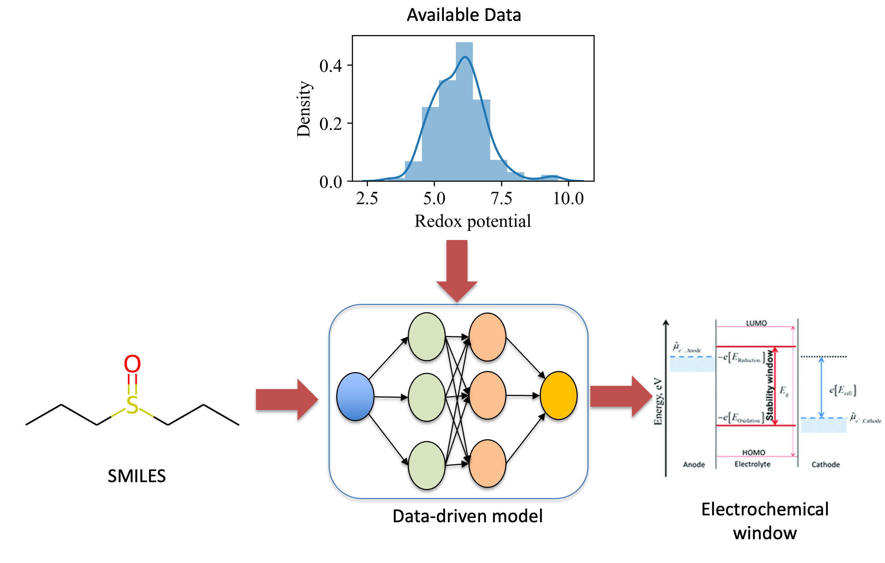

[](https://teslim404.com)
# BatteryInformatics
Source code and trained models for the paper "*Comparative Analysis of Structure-Property Machine Learning models for Predicting Electrolyte Thermodynamic Windows*". 


*General overview of the modeling framework*

<!-- TABLE OF CONTENTS -->
<h2 id="table-of-contents"> Table of Contents</h2>

<details open="open">
  <summary>Table of Contents</summary>
  <ol>
    <li><a href="#Set-up environment"> ➤ Set-up environment</a></li>
    <li>
          <a href="#Training"> ➤ Training Machine Learning Models</a>
          <ul>
            <li><a href="#Descriptor">Traditional Model</a></li>
            <li><a href="#Graph">Graph Neural Network</a></li>
            <li><a href="#LLM">Transformer</a></li>
          </ul>
    </li>
    <li><a href="#Status"> ➤ Status</a></li>
    <li><a href="#How-to-cite"> ➤ How to cite</a></li>
    <li><a href="#License"> ➤ License</a></li>
    <li><a href="#References"> ➤ References</a></li>
  </ol>
</details>


<!-- Set-up environment -->
<h2 id="Set-up environment">Set-up environment</h2>

Clone this repository and then use `setup.sh` to setup a virtual environment `binfo` with the required dependencies in `requirements.txt`. 

```bash
chmod +x setup.sh
git clone https://github.com/EnthusiasticTeslim/BatteryInformatics.git
cd BatteryInformatics
sh setup.sh
source binfo/bin/activate
```


<!-- Training Models-->
<h2 id="Training">Training Models</h2>

<h3 id="Descriptor"> Traditional Model</h3>

```
python src/descriptor/trainer.py -h
usage: trainer.py [-h] [--parent_directory PARENT_DIRECTORY] [--data_directory DATA_DIRECTORY] [--result_directory RESULT_DIRECTORY] [--src SRC] [--train_data TRAIN_DATA] [--test_data TEST_DATA] [--scale] [--hyperparameter HYPERPARAMETER] [--iterations ITERATIONS] [--cv CV] [--model MODEL] [--seed SEED]

options:
  --parent_directory PARENT_DIRECTORY
                        Path to main directory
  --data_directory DATA_DIRECTORY
                        where the data is stored in parent directory
  --result_directory RESULT_DIRECTORY
                        Path to result directory
  --src SRC             function source directory
  --train_data TRAIN_DATA
                        Path to train data
  --test_data TEST_DATA
                        Path to test data
  --scale               Scale data
  --hyperparameter HYPERPARAMETER
                        Hyperparameter space
  --iterations ITERATIONS
                        Number of iterations for hyperparameter optimization
  --cv CV               Number of cross-validation folds
  --model MODEL         Model to train
  --seed SEED           Random seed
```

The model and its predictions will be saved in `results/<MODEL>`. For example, to train a SVR model using RDKIT descriptor, you can use:

```bash
python -m src/descriptor/trainer.py --parent_directory YOUR_MAIN_FOLDER --result_directory results --data_directory data --train_data "train_data_cleaned.csv" --test_data "test_data_cleaned.csv" --scale --model SVR --seed 42 --iterations 100 --hyperparameter "hp_descriptor.yaml" --cv 5
```

To train the whole model ([SVR](https://scikit-learn.org/stable/modules/generated/sklearn.svm.SVR.html), [RandomForest](https://scikit-learn.org/stable/modules/generated/sklearn.ensemble.RandomForestRegressor.html), [AdaBoostRegressor](https://scikit-learn.org/stable/modules/generated/sklearn.ensemble.AdaBoostRegressor.html), [GradientBoostingRegressor](https://scikit-learn.org/stable/modules/generated/sklearn.ensemble.GradientBoostingRegressor.html)), 
```bash
chmod a+x regenerate/descriptor.sh
./descriptor.sh
```


<h3 id="Graph"> Graph Neural Network</h3>

```
python src/graph/trainer.py -h
trainer.py [-h] [--parent_directory PARENT_DIRECTORY] [--result_directory RESULT_DIRECTORY] [--data_directory DATA_DIRECTORY] [--train_data TRAIN_DATA] [--test_data TEST_DATA] [--add_features]
                  [--skip_cv] [--epochs EPOCHS] [--start-epoch START_EPOCH] [--batch_size BATCH_SIZE] [--lr LR] [--gpu GPU] [--cv CV] [--dim_input DIM_INPUT] [--unit_per_layer UNIT_PER_LAYER] [--seed SEED]
                  [--num_feat NUM_FEAT] [--train]

options:
  --parent_directory PARENT_DIRECTORY
                        Path to main directory
  --result_directory RESULT_DIRECTORY
                        Path to result directory
  --data_directory DATA_DIRECTORY
                        where the data is stored in parent directory
  --train_data TRAIN_DATA
                        name of train data
  --test_data TEST_DATA
                        name of test data
  --add_features        if add features
  --skip_cv             if skip cross validation
  --epochs EPOCHS       number of total epochs to run
  --start-epoch START_EPOCH
                        manual epoch number (useful on restarts)
  --batch_size BATCH_SIZE
                        mini-batch size (default: 256)
  --lr LR               initial learning rate
  --gpu GPU             GPU ID to use.
  --cv CV               k-fold cross validation
  --dim_input DIM_INPUT
                        dimension of input
  --unit_per_layer UNIT_PER_LAYER
                        unit per layer
  --seed SEED           seed number
  --num_feat NUM_FEAT   number of additional features
  --train               if train
```

To train the GNN model, 
```bash
chmod a+x regenerate/graph.sh
./graph.sh
```
and its checkpoints and predictions will be saved in `results/GNN`.

For example, to train a GNN model you can use:

```bash
python -m src/graph/trainer.py --parent_directory YOUR_MAIN_FOLDER --result_directory results --data_directory data --train_data "train_data_cleaned.csv" --test_data "test_data_cleaned.csv" --seed 42 --iterations 100 --train --cv 5
```
to test and an already train model, you can use:

```bash
python -m src/graph/trainer.py --parent_directory YOUR_MAIN_FOLDER --result_directory results --data_directory data --train_data "train_data_cleaned.csv" --test_data "test_data_cleaned.csv" --seed 42 --iterations 100 --cv 5
```

<h3 id="LLM"> Transformer</h3>

under construction

<!-- Status -->
<h2 id="Status">Status</h2>

- [x] Complete data cleaning
- [x] Scripts for QSPR with [RDKIT](https://rdkit.org/docs/index.html) descriptors.
- [x] Scripts for QSPR with [Graph](https://www.dgl.ai/). 
- [x] Train ML with RDKIT and Graph.
- [] Set up ML model with transformer.
- [] Evaluate performances.
- [] Deploy models as a GUI.

<!-- How-to-cite-->
<h2 id="How-to-cite">How to cite</h2>

```
@article{doi,
  author = {Teslim Olayiwola, Jose Romagnoli},
  title = {Comparative Analysis of Structure-Property Machine Learning models for Predicting Electrolyte Thermodynamic Windows},
  journal = {n/a},
  year = {n/a},
  volume = {n/a},
  number = {n/a},
  doi = {https://doi.org/},
  preprint = {Manuscript in Preparation}
}
```

<!-- License-->
<h2 id="License">License</h2>

BatteryInformatics is under MIT license. For use of specific models, please refer to the model licenses found in the original packages.

<!-- References -->
<h2 id="References">References</h2>

- Qin et al (2021) [Predicting Critical Micelle Concentrations for Surfactants Using Graph Convolutional Neural Networks](https://pubs.acs.org/doi/full/10.1021/acs.jpcb.1c05264)
- Miriam et al (2024) [Surfactant-Specific AI-Driven Molecular Design: Integrating Generative Models, Predictive Modeling, and Reinforcement Learning for Tailored Surfactant Synthesis](https://pubs.acs.org/doi/full/10.1021/acs.iecr.4c00401)
